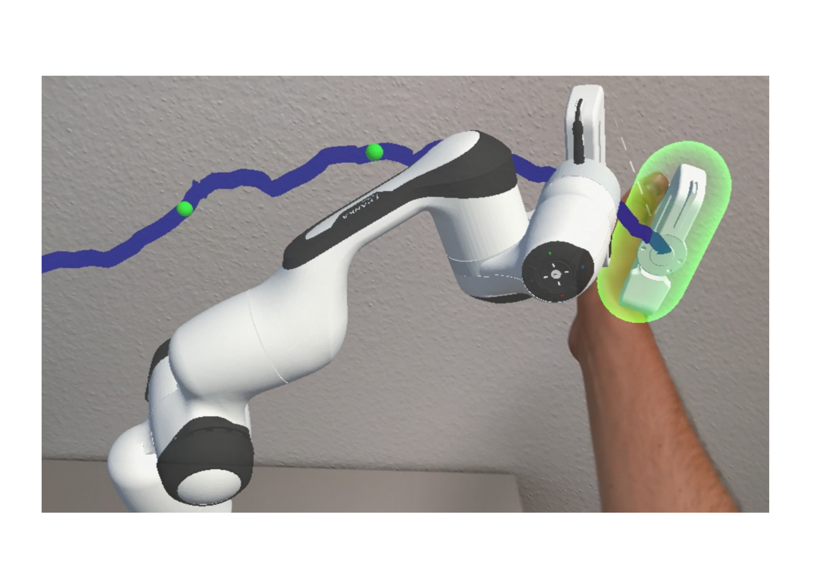
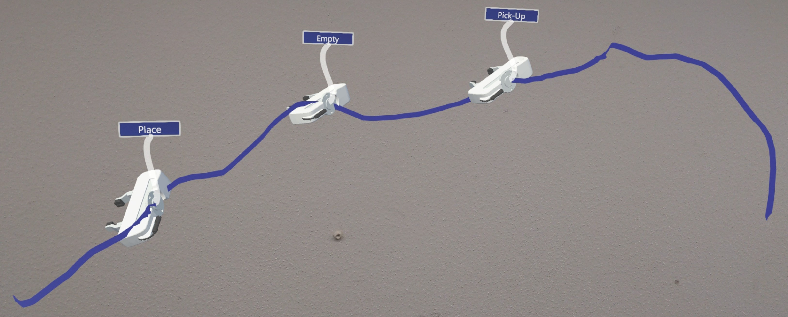
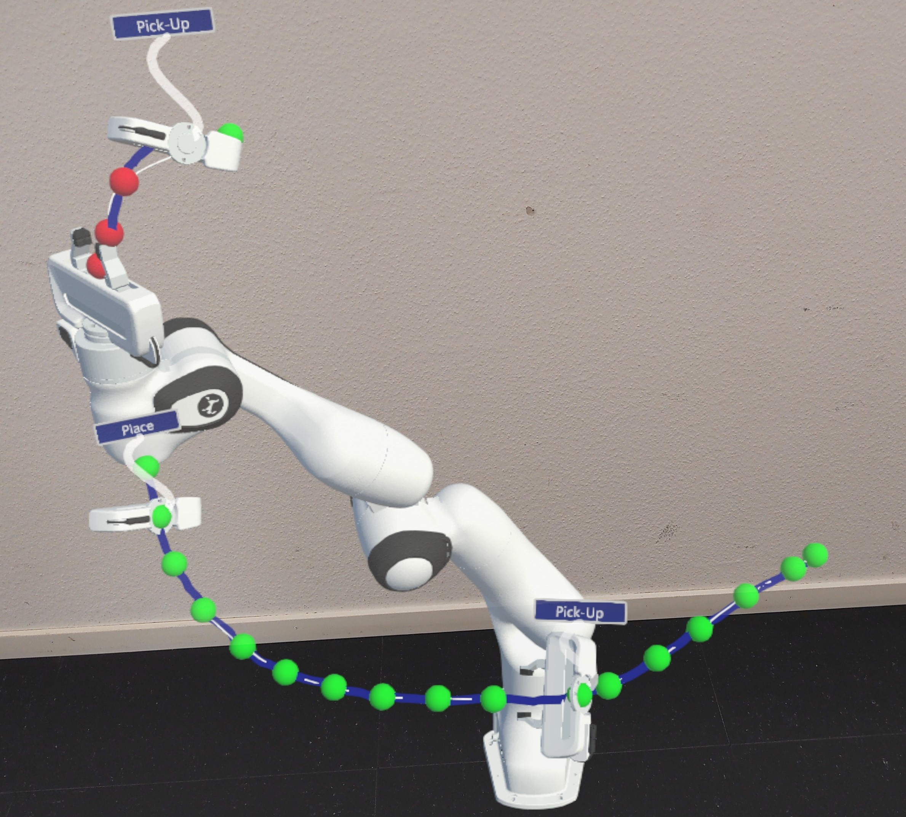
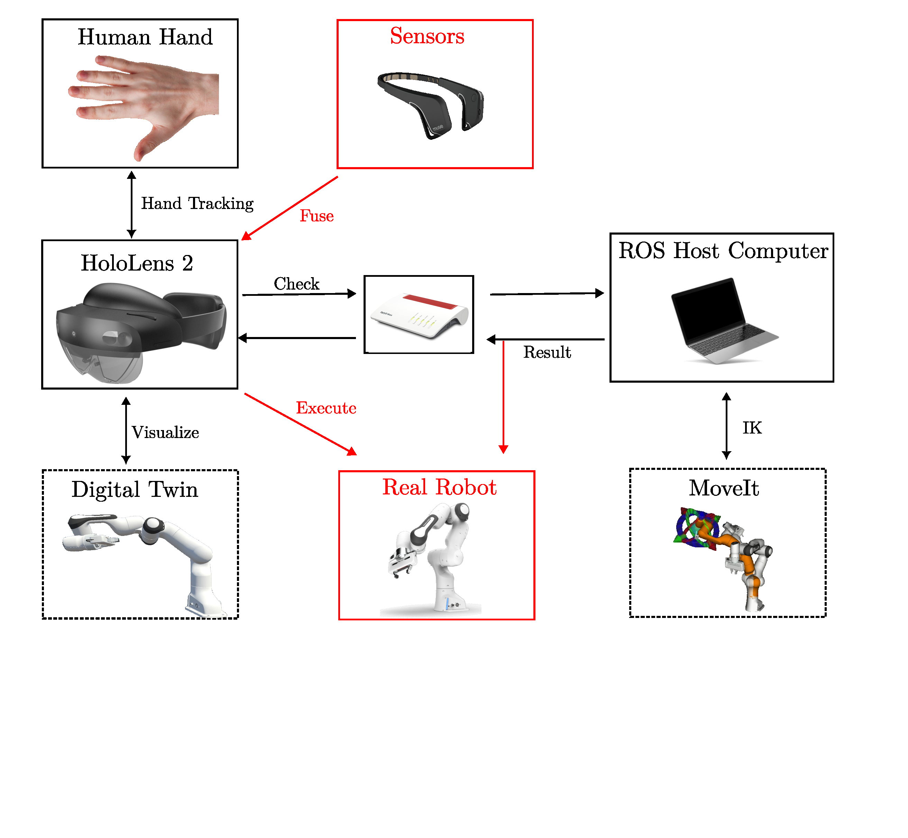

# RobotTaskTeaching3DHoloLens

## This project uses hand tracking of the HoloLens 2 to attach the end effector to the user's hand and teach a task with it to a robot

This application was built as a bachelor thesis at the pdZ lab at ETH Zurich. The user has a choice between a time and equidistance mode. Time mode records poses of the end effector at fixed intervals and checks them through ROS every few seconds, the result gets then visualized by the digital twin. In equidistance mode are points recorded at fixed distances from each other and the user has the choice to create a spline, which he can edit through the control points. It is built with Unity 3D v2021.3.19f1, MRTK v2.8.3.0 and uses URDF importer v0.5.2,  ROS-TCP-Connector v0.7.0 and, Bezier Solution v2.3.3.

### Using the app
After dragging the robot base to the wanted position with one hand and scaling and rotating it with two hands use the hand menu on the left hand to place the robot at the base. Select the wanted mode in the main menu and start tracking as described. In short, place the right hand where you want the recording to happen and make a thumbs-up gesture with the left hand to start and stop a recording. Along the way, you can create pick-up and place events by showing a pinch gesture or also empty events by showing a victory pose (palm towards your eyes). Events are thought to be later used for different end effector manipulations  (e.g. starting a welder) or also to change certain settings of the robot (e.g speed) or also to be used for the human-robot interaction, it is visualized by showing the position and orientation the end effector was in when they were recorded. 

This image shows a recorded trajectory with three events

A recorded trajectory with a spline which was checked for reachability by the IK

### Overview of scripts
* 

## Launching ROS host computer
Launch each of the commands in a new terminal:
1. roslaunch ros_tcp_endpoint endpoint.launch
2. roslaunch panda_moveit_config demo.launch (you can minimize RViz)
3. rosrun goal_state_publisher unity
   

## Known Bugs / Issues /Shortfallings
* Reattachin directly at the start/end does not work on the HoloLens (works on the PC)
* The implemented hand gestures create many false positives and are in general a bit unsatisfactory
* After the robot has been replaced at another position is the visualization off (angles received back from IK of ROS let it point somewhere else, also end effector fingers are no longer at the correct position)
